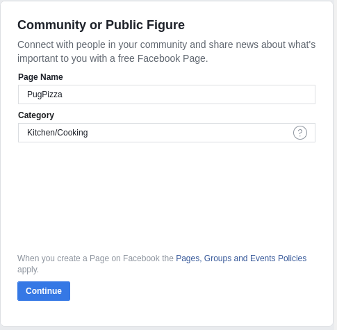
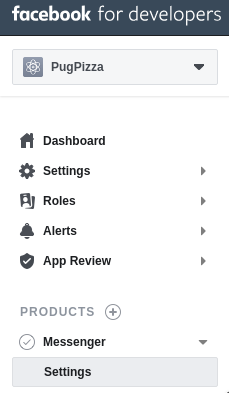

# Creación de un bot con Facebook Messenger

## Creando nuesta pagina en Facebook

1. Ir a <https://facebook.com/pages> y dar click sobre el botón **Create page**

2. En la opción **Comunity or Public Figure** dar click en el botón **Get Started**

    

3. Ponerle un nombre y categoría a nuestra pagina

    

## Crear aplicación en facebook for developers

1. Ir a <https://developers.facebook.com> y dar click sobre el botón **Log In**

2. Dar click en la opción **Create a New App ID**

    

## Configuracion del proyecto

1. Instalar **nodejs** y **npm**

    En Arch Linux y derivadas (Antergos, Manjaro)

    ```bash
    sudo pacman -Sy nodejs npm
    ```

    En Debian y derivadas (Ubuntu, Linux Mint)

    ```bash
    sudo apt install nodejs npm
    ```

2. Verificar que se instaló correctamente:

    ```bash
    node -v
    ```

3. Crear una carpeta para nuestro proyecto

    ```bash
    mkdir pugpizza
    ```

4. Entrar a nuestra carpeta recien creada e inicializar un repositorio local de git

    ```bash
    cd pugpizza
    git init
    ```

5. Vamos crear un archivo `package.json` que contendrá los datos de configuración de nuestra aplicación

    ```bash
    npm init
    ```

    Le pondremos los siguientes datos para nuestra aplicación

    ```bash
    package name: (pugpizza)
    version: (1.0.0)
    description: Bot de messenger para nuestra pizzería
    entry point: (index.js) app.js
    test command:
    git repository:
    keywords:
    author: Hassim
    license: (ISC): MIT
    ```

6. Crear un archivo nuevo llamado `app.js` aqui es donde va a ser desarrollado todo nuestro proyecto.

## Creación de Webhook

Vamos a instalar algunos modulos de **npm** necesarios

>* express
>* body-parser
>* request

```bash
npm install express body-parser request --save
```

En nuestro archivo `app.js` vamos a crear el webhook:

```js
//Habiitar el modo estricto
'use strict'

//Inluir los paquetes de nodejs que instalamos previamente
const express = require('express');
const bodyParser = require('body-parser');
const request = require('request');

//Creamos una constante llamada 'app' que extienda de express
const app = express();

//Configurar un puerto por defecto
app.set('port', 5000);

//Para que nuestro servidor entienda la configuración que va a recibir por medio de la API de Facebook
//tenemos que añadir una nueva configuración
app.use(bodyParser.json());

//Creamos una ruta principal donde va a estar nuestro servidor
app.get('/', function(req, response) {
    response.send("Hola Mundo!");
})

//Añadir nuestro webhook con el cual vamos a verificar con un Token la asignación que tendrá
//nuestra API de Facebook con nuestro código en nuestro servidor con Express
app.get('/webhook', function(req, response) {
    if(req.query['hub.verify_token'] === 'pugpizza_token') {
        response.send(req.query['hub.challenge']);
    } else {
        response.send("Pug Pizza no tienes permisos.");
    }
})

//Creamos un mensaje para saber si esta funciónando nuestra aplicación
app.listen(app.get('port'), function() {
    console.log("Nuestro servidor esta funciónando en el puerto: ", app.get('port'));
})
```

Iniciamos nuestra aplicación con **node**

```bash
node app.js
```

Y nos dará el mensaje que pusimos en nuestro archivo `app.js`

```bash
Nuestro servidor esta funciónando en el puerto:  5000
```

Abrimos nuestro navegador y nos vamos a `localhost:5000` y nos debe mostrar:

> Hola Mundo!

Si accedemos a `localhost:5000/webhook` nos debe mostrar:

> Pug Pizza no tienes permisos.

## Entorno y conexión del desarrollo local (nodemon/ngrok) con Messenger

1. Instalar `nodemon` el cual nos ayuda a mantener viva una sesión de nuestra aplicación.

    Debemos instalarlo primeramente de manera global con `sudo`

    ```bash
    sudo npm install -g nodemon
    ```

    Una vez instalado en nuestra carpeta del projecto lo instalamos como una herramienta de desarrollo usando el flag `--save-dev`

    ```bash
    npm install --save-dev nodemon
    ```

    Ahora corremos nuestra aplicación, pero en vez de usar `node app.js` usamos:

    ```bash
    nodemon app.js
    ```

    Nos dará la salida de que se esta ejecutando correctamente

    ```bash
    [nodemon] 1.18.11
    [nodemon] to restart at any time, enter `rs`
    [nodemon] watching: *.*
    [nodemon] starting `node app.js`
    Nuestro servidor esta funciónando en el puerto:  5000
    ```

2. Instalar `ngrok` el cual nos permite crear un tunel para que nuestra aplicación local pueda ser accedida desde internet.

    Este modulo no puede ser instalado desde **npm**, debemos ir a su pagina, registrarnos y descargar un archivo comprimido.

    * Vamos a su pagína: <https://ngrok.com/> y nos registramos.
  
    * Bajamos el archivo correcto para nuestra plataforma, lo descomprimimos y el contenido es un archivo llamado `ngrok`

    * El archivo `ngrok` lo copiamos y debemos pegarlo en la raiz de nuestro proyecto.

    * Abrimos otra pestaña en nuestra terminal ya que no debemos matar el proceso de `nodemon` y ejecutamos `ngrok` especificando el puerto que tenemos configurado en `app.js`

        ```bash
        ./ngrok http 5000
        ```

        Esto nos dara una salida en la terminal indicando el dominio de internet desde donde podremos acceder a nuestro entorno local:

        

## Recibir mensajes con Messenger

1. Accedemos a nuestro panel de control de **facebook for developers** y damos click en la barra lateral izquierda en **Messenger > Settings**

    

2. Generamos un token seleccionando nuesta pagina de Facebook del listado, en este caso **PugPizza** y damos click en el botón **Edit Permissions**

    

3. Nos pedira autenticarnos con nuestra cuenta de Facebook y seleccionar a cual pagina queremos ligar el token, en este caso **PugPizza**

    

4. Ir a la sección de **Webhooks** y dar click en el botón **Suscribe To Events**, en la ventana que se abre debemos poner en el **Callback URL** el dominio que nos generó **ngrok** seguido de **/webhook**, mas abajo el nombre del token que configuramos en `app.js` (**pugpizza_token**) y seleccionar la primera fila de **Subscription Fields** para finalmente dar en **Verify and Save**

    

    

5. Se recargara nuestra pagina, volvemos a la sección de Webhooks y seleccionamos **PugPizza** de la lista y damos click en **Suscribe**

    

6. Volvemos a nuestro archivo `app.js` y agregaremos código para poder recibir los mensajes que nos manden desde messenger

    ```js
    //Saber lo que el usuario nos manda desde messenger
    app.post('/webhook', function(req, response) {
        const webhook_event = req.body.entry[0];
        if(webhook_event.messaging) {
            webhook_event.messaging.forEach(event => {
                console.log(event);
            })
        }
        response.sendStatus(200);
    })
    ```

7. Ahora nos vamos a <https://messenger.com> y buscamos PugPizza para enviarle un mensaje, probemos con un **Hola**

    

8. Si nos vamos a nuestra terminal veremos que aparece el mensaje en formato JSON

    

## Responder mensajes con Messenger

Lo primero que haremos sera crear una constante en `app.js` con nuestro token que previamente habiamos generado desde el panel de control de facebook for developers ya que lo vamos a necesitar en las posteriores funciónes

```js
const access_token = "EAAlf2OMvQJ0BAGD5...";
```

Ahora crearemos una función que obtenga el mensaje recibido del usuario y prepare un mensaje que le enviaremos de respuesta:

1. Lo que haremos es recibir el mensaje y almacenar en constantes el **id del remitente** y el **mensaje**, si observamos veremos que a traves del parametro `event` estamos obteniendo el objeto JSON del mensaje, por lo que para obtener el id del **sender** debemos navegar dentro de los objetos del JSON, es decir primero ir a `sender` y luego mas adentro al `id`. De igual manera para obtener el texto del mensaje navegamos a `message` y luego a `text`

2. Creamos una constante llamada `messageData` donde definimos el mensaje que enviaremos de vuelta, en este caso le mandaremos exactamente el mismo mensaje de vuelta al usuario.

3. Llamamos una función para enviar ese mensaje de vuelta que llamaremos `callSendApi` pasandole como parametro el `messageData`, esta función aun no existe por lo que la debemos crear.

    ```js
    //Procesar los mensajes recibidos
    function handleMessage(event) {
        const senderId = event.sender.id;
        const messageText = event.message.text;

        const messageData = {
            recipient: {
                id: senderId
            },
            message: {
                text: messageText
            }
        }
        callSendApi(messageData);
    }
    ```

Creamos la función `callSendApi` la cual usando el modulo de npm `request` que habíamos agregado anteriormente mandará una solicitud a traves de la API de Facebook llamada `Send API` con el mensaje que en este caso se encuentra en formato JSON en la variable que pasamos por parametro `response`, aqui debemos pasarle nuestro token que habíamos almecenado en la constante `access_token`

```js
function callSendApi(response) {
    request({
            "uri": "https://graph.facebook.com/v3.2/me/messages",
            "qs": {
                "access_token": access_token
            },
            "method": "POST",
            "json": response
        },
        function (err) {
            if (err) {
                console.log("Ha ocurrido un error");
            } else {
                console.log("Mensaje enviado");
            }
        }
    )
}
```

Ahora probamos enviarle un mensaje desde messenger y veremos que nos contesta exactamente lo mismo que le mandamos


## Añadir integración de bienvenida

Para añadir un mensaje de bienvenida, haremos uso de `curl`, en la terminal deberemos agregar lo siguiente, el cual sera un `payload` que recibiremos cuando el usuario de click en el messenger en un botón de **Empezar** que le aparecera a partir de ahora, esto con la finalidad de facilitarle al usuario el inicio del bot:

```json
curl -X POST -H "Content-Type: application/json" -d '{
    "get_started": {"payload":
        "GET_STARTED_PUGPIZZA"
    }
}' "https://graph.facebook.com/v3.2/me/messenger_profile?access_token=EAAlf2O..."

```

Ahora configuraremos el mensaje de bienvenida en dos idiomas, español (default) e inglés:

```json
curl -X POST -H "Content-Type: application/json" -d '{
    "greeting": [
        {
            "locale": "default",
            "text": "Hola {{user_first_name}}, soy PugPizza y te recomiendo las mejores pizzas"
        },
        {
            "locale": "en_US",
            "text": "Hi {{user_first_name}}, im PugPizza and i recommend you the best pizzas"
        }
    ]
}' "https://graph.facebook.com/v3.2/me/messenger_profile?access_token=EAAlf2O..."
```

Si nos vamos al messenger veremos que ahora en vez de tener que escribir algo, nos aparecerá el botón de **Empezar (Get Started)**


## Crear menú persistente

Creamos nuestro menú haciendo uso de **Persistent Menu** de la **API de Facebook**

```json
curl -X POST -H "Content-Type: application/json" -d '{
"persistent_menu": [{
  "locale": "default",
  "composer_input_disabled": false,
  "call_to_actions": [{
      "title": "🍕 PugPizza ",
      "type": "nested",
      "call_to_actions": [{
          "title": "Acerca",
          "type": "postback",
          "payload": "ABOUT_PAYLOAD"
        },
        {
          "title": "Sucursales",
          "type": "postback",
          "payload": "LOCATIONS_PAYLOAD"
        },
        {
          "title": "Ayuda",
          "type": "postback",
          "payload": "HELP_PAYLOAD"
        },
        {
          "title": "Contacto",
          "type": "postback",
          "payload": "CONTACT_PAYLOAD"
        }
      ]
    },
    {
      "title": "💚 Menu de Productos",
      "type": "nested",
      "call_to_actions": [{
          "title": "Pizzas",
          "type": "postback",
          "payload": "PIZZAS_PAYLOAD"
        },
        {
          "title": "Especialidades",
          "type": "postback",
          "payload": "SPECIALS_PAYLOAD"
        },
        {
          "title": "Bebidas",
          "type": "postback",
          "payload": "DRINKS_PAYLOAD"
        },
        {
          "title": "Promociones",
          "type": "postback",
          "payload": "PROMOTIONS_PAYLOAD"
        }
      ]
    },
    {
      "type": "web_url",
      "title": "🐶 Pagina Web",
      "url": "http://platzi.com/bots-messenger/",
      "webview_height_ratio": "full"
    }
  ]
}]
}' "https://graph.facebook.com/v3.2/me/messenger_profile?access_token=EAAlf2OMvQJ0BAGD5Ab1wvgaQ03DhReEZCdT3XqEgr81SPSbbIRQilRuST0gXrxdvXCzzixRdp6GuP6LLnxF6IICk6ES9IndzGoBgU7Qy02kibtJHZBHYmqPjEUHjGnoBAb3YimoJU8Rie9CQsbOsDlE7I6SAFxwlmGlnM3Pwa8ZCACosRZAZCCqPZB9sgZB4PwZD"
```

## Manejo de eventos: Messages

Ahora debemos modificar nuestra función que teniamos al principio llamada `handleMessage` la cual le repetia al usuario el mismo mensaje recibido.

Vamos a eliminar o comentar la función anterior:

```js
/*
//Procesar los mensajes recibidos
function handleMessage(event) {
    const senderId = event.sender.id;
    const messageText = event.message.text;
    const messageData = {
        recipient: {
            id: senderId
        },
        message: {
            text: messageText
        }
    }
    callSendApi(messageData);
}
*/
```

Y la sustituiremos por un conjunto de funciones:

```js
//Funciones para manejar los eventos recibidos
function handleEvent(senderId, event) {
    if(event.message) {
        handleMessage(senderId, event.message);
    }
}

function handleMessage(senderId, event) {
    if(event.text) {
        defaultMessage(senderId);
    }
}

function defaultMessage(senderId) {
    const messageData = {
        "recipient": {
            "id": senderId
        },
        "message": {
            "text": "Hola soy un bot de messenger, y te invito a utilizar nuestro menu"
        }
    }
    callSendApi(messageData);
}
```

Como hemos modificado la funcion principal, tambien deberemos modificar nuestro funcion de webhook, sustituyendo donde usabamos la funcion anterior `handleMessage` por `handleEvent` y ahora en vez de uno espera recibir dos parametros:

```js
//Saber lo que el usuario nos manda desde messenger
app.post('/webhook', function (req, response) {
    const webhook_event = req.body.entry[0];
    if (webhook_event.messaging) {
        webhook_event.messaging.forEach(event => {
            //console.log(event);
            //handleMessage(event);
            handleEvent(event.sender.id ,event);
        })
    }
    response.sendStatus(200);
})
```

## Manejo de eventos: Postback

Debemos crear una función para poder recibir los **Payloads** de acuerdo a la acción que este realizando el usuario, por ejemplo cuando de click en el botón **Empezar (Get Started)** en el messenger:

```js
//Función para manejar los Payloads recibidos
function handlePostback(senderId, payload) {
    switch(payload) {
        case "GET_STARTED_PUGPIZZA":
            console.log(payload);
        break;
    }
}
```

Una vez creada debemos agregarla a nuestra función existente `handleEvent` a través de un `else if`:

```js
//Funciones para manejar los eventos recibidos
function handleEvent(senderId, event) {
    if(event.message) {
        handleMessage(senderId, event.message);
    } else if (event.postback) {
        handlePostback(senderId, event.postback.payload);
    }
}
```

Ahora cada vez que demos click al botón **Empezar** en el messenger podemos observar en la terminal que nos devolverá el nombre del **payload**, en este caso **GET_STARTED_PUGPIZZA**.

## Manejo de eventos: Attachments

Los Attachments son todos los tipos de archivos adjuntos que podemos enviar desde Messenger: imágenes, audios, videos, entre otros. Nuestro bot debe responder dependiendo el Attachment que envíen nuestros usuarios. Para esto creamos una funcion que procese esto llamada `handleAttachments`

```js
//Función para manejar los adjuntos (attachments)
function handleAttachments(senderId, event) {
    let attachment_type = event.attachments[0].type;
    switch(attachment_type) {
        case "image":
            console.log(attachment_type);
        break;
        case "video":
            console.log(attachment_type);
        break;
        case 'audio':
            console.log(attachment_type);
        break;
        case 'file':
            console.log(attachment_type);
        break;
    }
}
```

Y la agregamos a la función existente `handleMessage`:

```js
function handleMessage(senderId, event) {
    if(event.text) {
        defaultMessage(senderId);
    } else if(event.attachments) {
        handleAttachments(senderId, event);
    }
}
```

Ahora al adjuntarle algo al bot, el sabra que tipo de adjunto es y lo imprimira en nuestra terminal.

## Respuestas rápidas y acciones de envío

Podemos configurar las respuestas rapidas que ejecuta nuestro bot, para eso dentro de la funcion `defaultMessage` justo debajo del mensaje de presentacion, agregamos el siguiente código:

```json
"quick_replies": [
    {
        "content_type": "text",
        "title": "Quieres una Pizza?",
        "payload": "PIZZAS_PAYLOAD"
    },
    {
        "content_type": "text",
        "title": "Acerca de",
        "payload": "ABOUT_PAYLOAD"
    }
]
```

Tambien podemos simular acciones como por ejemplo que parezca que el bot esta escribiendo, esto lo haremos crenado una nueva función:

```js
//Funcion para enviar acciones al usuario (Simular que estamos escribiendo)
function senderActions(senderId) {
    const messageData = {
        "recipient" : {
            "id": senderId
        },
        "sender_action":"typing_on"
    }
    callSendApi(messageData);
}
```

Otras acciones:

>* mark_seen: Marcar el mensaje como leído
>* typing_off: Desactivar los indicadores de escritura

Debemos agregar a dentro de nuestra función `defaultMessage` la función recién creada `senderActions` para que tenga efecto, asi que nuestra funcion completa quedaría de esta forma:

```js
function defaultMessage(senderId) {
    const messageData = {
        "recipient": {
            "id": senderId
        },
        "message": {
            "text": "Hola soy un bot de messenger, y te invito a utilizar nuestro menu",
            "quick_replies": [
                {
                    "content_type": "text",
                    "title": "Quieres una Pizza?",
                    "payload": "PIZZAS_PAYLOAD"
                },
                {
                    "content_type": "text",
                    "title": "Acerca de",
                    "payload": "ABOUT_PAYLOAD"
                }
            ]
        }
    }
    senderActions(senderId);
    callSendApi(messageData);
}
```

## Templates y listado de elementos

Para poder presentar al usuario un listado de elementos, en este caso un listado de las pizzas, vamos a crear una nueva funcion que contendra todas las variantes de pizzas que tenemos:

```js
function showPizzas(senderId) {
    const messageData = {
        "recipient": {
            "id":senderId
        },
        "message": {
            "attachment": {
                "type": "template",
                "payload": {
                    "template_type": "generic",
                    "elements" : [
                        {
                            "title":"Pepperoni",
                            "subtitle":"Con todo el sabor del pepperoni",
                            "image_url": "https://s3.amazonaws.com/chewiekie/img/productos-pizza-peperoni-champinones.jpg",
                            "buttons": [
                                {
                                    "type": "postback",
                                    "title": "Elegir Pepperoni",
                                    "payload": "PEPPERONI_PAYLOAD"
                                }
                            ]
                        },
                        {
                            "title":"Pollo BBQ",
                            "subtitle":"Con todo el sabor del pollo BBQ",
                            "image_url": "https://s3.amazonaws.com/chewiekie/img/productos-pizza-peperoni-champinones.jpg",
                            "buttons": [
                                {
                                    "type": "postback",
                                    "title": "Elegir Pollo BBQ",
                                    "payload": "BBQ_PAYLOAD"
                                }
                            ]
                        }
                    ]
                }
            }
        }
    }
    callSendApi(messageData);
}
```

Ahora debemos detectar el **payload** de cuando el usuario selecciona del **Menu de productos** -> **Pizzas**, para esto vamos a agregarle un **CASE** nuevo al switch de la funcion `handlePostback` que es la que recibe los payloads:

```js
case "PIZZAS_PAYLOAD":
    showPizzas(senderId);
break;
```

## Crear un template de lista vertical

Ahora vamos a crear un template en forma de lista, para que el usuario seleccione el tamaño de la pizza elegida, vamos a agregar una nueva función:

```js
// Funcion para mostrar el tamano de las pizza que quiere ordenar
function sizePizza(senderId) {
    const messageData = {
        "recipient": {
            "id": senderId
        },
        "message": {
            attachment: {
                "type": "template",
                "payload": {
                    "template_type": "list",
                    "top_element_style": "large",
                    "elements": [
                        {
                            "title": "Individual",
                            "image_url": "https://s3.amazonaws.com/chewiekie/img/productos-pizza-peperoni-champinones.jpg",
                            "subtitle":"Porcion individual",
                            "buttons": [
                                {
                                    "type": "postback",
                                    "title": "Elegir individual",
                                    "payload": "PERSONAL_SIZE_PAYLOAD"
                                }
                            ]
                        },
                        {
                            "title": "Mediana",
                            "image_url": "https://s3.amazonaws.com/chewiekie/img/productos-pizza-peperoni-champinones.jpg",
                            "subtitle":"Porcion mediana",
                            "buttons": [
                                {
                                    "type": "postback",
                                    "title": "Elegir mediana",
                                    "payload": "MEDIUM_SIZE_PAYLOAD"
                                }
                            ]
                        }
                    ]
                }
            }
        }
    }
    callSendApi(messageData);
}
```

Ahora vamos a agregarle un **CASE** nuevo al switch de la funcion `handlePostback` que es la que recibe los payloads, donde uno de ellos sera para la pizza de pepperoni y otro para la de BBQ:

```js
case "PEPPERONI_PAYLOAD":
    sizePizza(senderId);
break;
case "BBQ_PAYLOAD":
    sizePizza(senderId);
break;
```

## Usar WebViews

Podemos abrir paginas dentro del propio messenger utilizando webviews, vamos a crear una funcion que muestre la ubicación de las sucursales en un mapa:

```js
//Funcion para un webview dentro del messenger, en este caso mostraremos un mapa
function showLocations(senderId) {
    const messageData = {
        "recipient": {
            "id": senderId
        },
        "message": {
            "attachment": {
                "type": "template",
                "payload": {
                    "template_type": "list",
                    "top_element_style": "large",
                    "elements": [
                        {
                            "title": "Sucursal Mexico",
                            "image_url": "https://s3.amazonaws.com/chewiekie/img/productos-pizza-peperoni-champinones.jpg",
                            "subtitle": "Direccion bonita #555",
                            "buttons": [
                                {
                                    "title": "Ver en el mapa",
                                    "type": "web_url",
                                    "url": "https://goo.gl/maps/GCCpWmZep1t",
                                    "webview_height_ratio": "full"
                                }
                            ]
                        },
                        {
                            "title": "Sucursal Colombia",
                            "image_url": "https://s3.amazonaws.com/chewiekie/img/productos-pizza-peperoni-champinones.jpg",
                            "subtitle": "Direccion muy lejana #333",
                            "buttons": [
                                {
                                    "title": "Ver en el mapa",
                                    "type": "web_url",
                                    "url": "https://goo.gl/maps/GCCpWmZep1t",
                                    "webview_height_ratio": "tall"
                                }
                            ]
                        }
                    ]
                }
            }
        }
    }
    callSendApi(messageData);
}
```

Para probar si funciona podemos hacerlo en `handleMessage` cuando el usuario nos mande cualquier cosa:

```js
function handleMessage(senderId, event) {
    if(event.text) {
        //defaultMessage(senderId);
        //messageImage(senderId);
        //contactSupport(senderId);
        showLocation(senderId);
    } else if(event.attachments) {
        handleAttachments(senderId, event);
    }
}
```

## Receipt Template

Vamos a generar un recibo de pago mediante un template, simulando la compra de uno de nuestro usuarios, para esto crearemos la funcion para visualizar dicho recibo:

```js
//Función para generar un recibo de pago
function receipt(senderId) {
   const messageData = {
       "recipient": {
           "id": senderId
       },
       "message": {
           "attachment": {
               "type": "template",
               "payload": {
                   "template_type": "receipt",
                   "recipient_name": "User Name",
                   "order_number": "1212120",
                   "currency": "MXN",
                   "payment_method": "Efectivo",
                   "order_url": "https://platzi.com/order/123",
                   "timestamp": "123123123",
                   "address": {
                       "street_1": "platzi hq",
                       "street_2": "none",
                       "city": "Mexico",
                       "postal_code": "54654",
                       "state": "Mexico",
                       "country": "Mexico"
                   },
                   "summary": {
                        "subtotal": 12.00,
                        "shipping_cost": 2.00,
                        "total_tax": 1.00,
                        "total_cost": 15.00
                   },
                   "adjustments": [
                       {
                            "name": "Descuento frecuente",
                            "amount": 1.00
                       }
                   ],
                   "elements": [
                       {
                           "title": "Pizza Pepperonni",
                           "subtitle": "La mejor pizza de Pepperonni",
                           "quantity": 1,
                           "price": 10,
                           "currency": "MXN",
                           "image_url": "https://s3.amazonaws.com/chewiekie/img/productos-pizza-peperoni-champinones.jpg",
                       },
                       {
                            "title": "Bebida",
                            "subtitle": "Jugo de tamarindo",
                            "quantity": 1,
                            "price": 2,
                            "currency": "MXN",
                            "image_url": "https://s3.amazonaws.com/chewiekie/img/productos-pizza-peperoni-champinones.jpg",
                        }
                    ]
               }
           }
       }
   }
   callSendApi(messageData);
}
```

Para probar si funciona podemos hacerlo en `handleMessage` cuando el usuario nos mande cualquier cosa:

```js
function handleMessage(senderId, event) {
    if(event.text) {
        //defaultMessage(senderId);
        //messageImage(senderId);
        //contactSupport(senderId);
        //showLocation(senderId);
        receipt(senderId);
    } else if(event.attachments) {
        handleAttachments(senderId, event);
    }
}
```

## Obtener la localizacion del usuario

Vamos a pedir al usuario que nos comparta su ubicacion actual:

```js
//Función para obtener la ubicación del usuario
function getLocation(senderId) {
    const messageData = {
        "recipient": {
            "id": senderId
        },
        "message": {
            "text": "Ahora puedes proporcionarnos tu ubicacion",
            "quick_replies": [{
                "content_type": "location"
            }]
        }
    }
    callSendApi(messageData);
}
```

Para probar si funciona podemos hacerlo en `handleMessage` cuando el usuario nos mande cualquier cosa:

```js
function handleMessage(senderId, event) {
    if(event.text) {
        //defaultMessage(senderId);
        //messageImage(senderId);
        //contactSupport(senderId);
        //showLocation(senderId);
        //receipt(senderId);
        getLocation(senderId);
    } else if(event.attachments) {
        handleAttachments(senderId, event);
    }
}
```

Para poder ver en consola los datos de la ubicacion, debemos agregar un nuevo **CASE** en nuestra función `handleAttachments`, usaremos `JSON.stringify()` para convertitlo a una cadena:

```js
case 'location':
    console.log(JSON.stringify(event));
break;
```

El JSON obtenido es algo asi, de donde podremos obtener las coordenadas (latitud y longitud):

```json
{
    "mid": "v5e0d_hre6o5ToLLX5oLgXVUwvbv3aVSOVYy3JKDnZSD8hL6ynQnPZOxMMTv_l82i5qwyoSmt8TTCdO8C5KOSQ",
    "seq": 618,
    "attachments": [{
        "title": "Facultad de Pedagogia UV",
        "url": "https://l.facebook.com/l.php?u=https%3A%2F%2Fwww.bing.com%2Fmaps%2Fdefault.aspx%3Fv%3D2%26pc%3DFACEBK%26mid%3D8100%26where1%3DAV.%2BARCO%2BSUR%252C%2B%2BXALAPA-VERACRUZ%252C%2B91098%2BXalapa%252C%2BMexico%26FORM%3DFBKPL1%26mkt%3Den-US&h=AT3A76dodoU1LI2NJ6LEPYQdH2gLHRgHi7xBaIrbsXa6Gte9wKl3zzvD3CEbXXIfoHbEa1KynvGgeoiHpe5Pr6-N48z2BV1f5u1c0WFmLfMvbtgIGa-hpLfw-ZJjjuqj7pJeO4XMRbHXFwE&s=1",
        "type": "location",
        "payload": {
            "coordinates": {
                "lat": 19.508077141247,
                "long": -96.888988283944
            }
        }
    }]
}
```

## Subir nuestra app a producción con Heroku

1. Registarse en la pagina web de Heroku

2. Instalar Heroku CLI

    ```bash
    yay -Sy heroku-cli
    ```

3. Desde la terminal inciar sesión

    ```bash
    heroku login
    ```

4. Crear la aplicación

    ```bash
    heroku create [NOMBRE DE TU APLICACIÓN]
    ```

5. Editar el archivo `package.json` añadiendo el script `start` para que Heroku sepa como iniciar nuesta aplicación

    ```json
    "scripts": {
        "test": "echo \"Error: no test specified\" && exit 1",
        "start": "node app.js"
    },
    ```

    Si queremos especificar la versión de nodejs a utilizar también añadimos la siguiente linea:

    ```json
    "engines": {
        "node": "11.14.0"
    }
    ```

6. Añadimos el remoto de Heroku

    ```bash
    heroku git:remote -a pugpizza-platzi
    ```

7. Añadimos todos los archivos a staging y hacemos commit

    ```bash
    git add .
    git commit -m "mensaje"
    ```

8. Hacemos push a Heroku

    ```bash
    git push heroku master
    ```

9. Al finalizar nos dara una url que sera la de nuestra app ya en producción, esta URL debemos actualizarla en la pagina de Facebook Developers en el apartado de **Webhooks** para sustituir la que teniamos de **ngrok**.